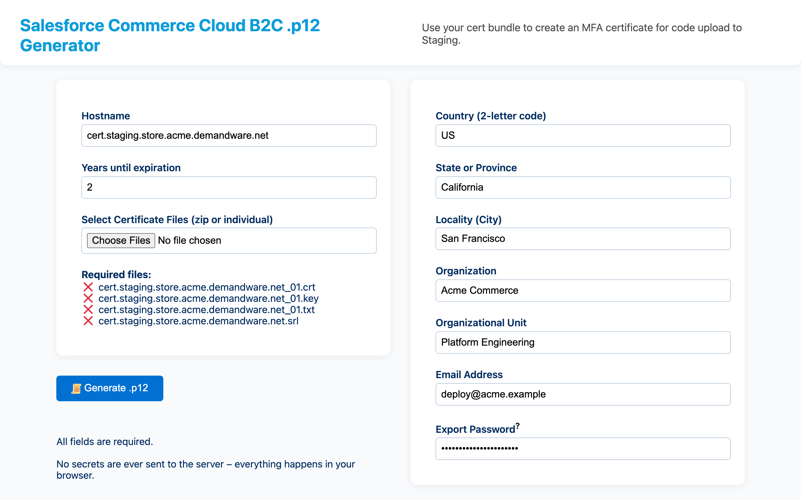

# p12-generator

Issue the client certificate that Salesforce B2C Commerce two-factor code upload requires, and package it as a `.p12`, entirely in the browser.

**Live: [p12.sfcc-test.com](https://p12.sfcc-test.com)**



## Why

Two-factor code upload to a Staging instance authenticates with a client certificate. B2C Commerce gives you a CA bundle -- `<host>_01.crt`, `<host>_01.key`, `<host>_01.txt` (the key's password), and `<host>.srl` -- and expects you to generate your own keypair, sign a certificate against that CA, and bundle the result into a PKCS#12 keystore.

Done by hand that is several `openssl` invocations in sequence, each with flags that matter, failing in ways the error messages do not explain. This page does the whole chain instead: generate a 2048-bit RSA keypair, build a CSR from the subject details you enter, sign it with the CA from the bundle, and export a password-protected `.p12`.

**Nothing leaves your machine.** There is no server side -- the CA key is decrypted, the certificate signed, and the keystore built by JavaScript in your own tab. That is the only responsible design for a page handling private keys, and because the source is unminified you can confirm it rather than take my word for it.

## Using it

1. Enter the instance hostname. The file checklist updates live, so a missing or misnamed file shows up before you generate anything.
2. Set how many years the certificate should be valid for.
3. Drop in the four files from B2C Commerce, or the zip they arrived in – the zip is unpacked in-browser, an optional containing folder is flattened, and duplicate filenames are rejected rather than overwritten.
4. Fill in the certificate subject: country, state, locality, organization, unit, email.
5. Set the keystore export password, then generate and download.

## Notes on the crypto

`main.js` is deliberately shipped unminified, so anyone handing a private key to this page can read what happens to it.

[node-forge](https://github.com/digitalbazaar/forge) does the cryptography and [fflate](https://github.com/101arrowz/fflate) the zip handling, both used as published with one exception. `forge.pkcs12.toPkcs12Asn1` hardcodes SHA-1 for the PKCS#12 MAC and encrypts only the private key, so it is wrapped as `toPkcs12Asn1New` to make the MAC algorithm selectable and to encrypt the certificate chain as well.

Certificates are signed with SHA-256. The serial number is derived from the current timestamp rather than read from the `.srl` file: the conventional approach is to use that number and increment it, which assumes a single authority tracking state, and a timestamp avoids collisions without needing to write the file back.

## Development

```bash
npm ci
npm test
npm run build
npm start        # webpack-dev-server
npm run deploy:dry-run
```

A single webpack bundle over a static page. There is no backend to run.

The page metadata and crawler files use `https://p12.sfcc-test.com/` as the canonical URL, including when the legacy hostname serves the same application.

## Deployment

The assets-only Cloudflare Worker `p12-generator` serves `p12.sfcc-test.com` and `p12.fad.bz`. `wrangler.jsonc` declares both Custom Domains and returns HTTP 404 for unknown paths instead of serving duplicate homepage content. `npm run deploy:dry-run` validates the production configuration without publishing; `npm run deploy` repeats the release checks and publishes through Wrangler.

## Releases

Use `npm version` as the only release entrypoint. To publish the version already declared in `package.json`, run `npm version "$(node -p 'require("./package.json").version')" --allow-same-version`; later releases use `npm version <major|minor|patch>`. Both forms run the clean-main and remote-synchronization guard, repeat the release check, create the version commit and tag, and push both refs atomically. The tag-triggered GitHub Actions workflow verifies the exact tagged static application and creates the published GitHub Release; an explicit workflow dispatch can safely retry an existing tag.

## License and attribution

Apache-2.0 -- see [LICENSE](LICENSE) and [NOTICE](NOTICE).

Copyright is held by Salesforce, Inc., because the tool was developed using Salesforce resources. It is **not** an official Salesforce product: not published, supported, or endorsed by Salesforce, and offered with no warranty or support commitment.

Icons come from [svgrepo](https://www.svgrepo.com) (Twemoji, Flat UI, and Essential collections); see [static/icons/ATTRIBUTION.txt](static/icons/ATTRIBUTION.txt).
